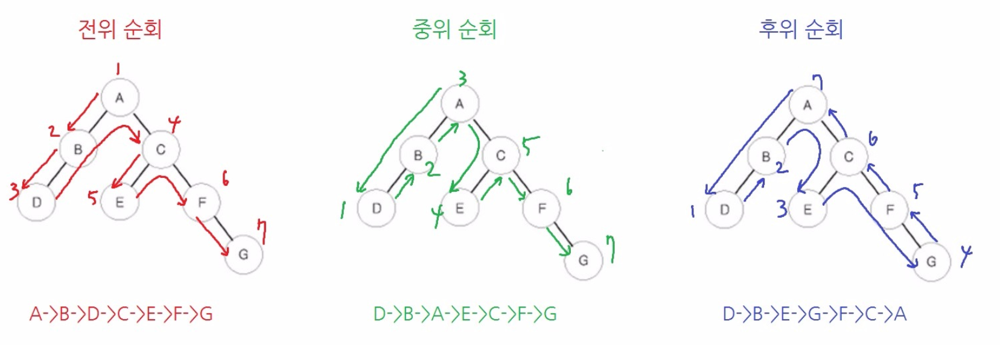

# 6부
### 21강 - 트리의 구현과 순회
* 트리란?
  * 노드로 이루어진 자료구조
  * 트리 관련 용어
    * 노드(node) : 자료의 각 위치/항목
    * 루트 노드(root node): 부모가 없는 노드, 트리는 하나의 루트 노드만을 가진다.
    * 단말 노드(leaf node): 자식이 없는 노드, ‘말단 노드’ 또는 ‘잎 노드’라고도 부른다.
    * 내부(internal) 노드: 단말 노드가 아닌 노드
    * 간선(edge): 노드를 연결하는 선 (link, branch 라고도 부름)
    * 형제(sibling): 같은 부모를 가지는 노드
    * 노드의 크기(size): 자신을 포함한 모든 자손 노드의 개수
    * 노드의 깊이(depth): 루트에서 어떤 노드에 도달하기 위해 거쳐야 하는 간선의 수
    * 노드의 레벨(level): 트리의 특정 깊이를 가지는 노드의 집합
    * 노드의 차수(degree): 하위 트리 개수 / 간선 수 (degree) = 각 노드가 지닌 가지의 수
    * 트리의 차수(degree of tree): 트리의 최대 차수
    * 트리의 높이(height): 루트 노드에서 가장 깊숙히 있는 노드의 깊이
    
  * 기본 개념
    1. 하나의 루트 노드를 가진다
    2. 루트 노드는 0개 이상의 자식 노드를 가진다
    3. 자식 노드 또한 0개 이상의 자식노드를 가진다.
    4. 비선형 자료구조로 **계층적 관계**를 표현하며 사이클(cycle)이 존재할수 없다.
  * 특징
    * 그래프의 한 종류로 **최소 연결트리**라고 불린다. 
    * 노드가 N개인 트리는 n-1개의 간선을 가진다
    * 루트에서 어떤 노드로 가는 경로는 유일하다.
    * 루트 노드는 1개이며 모든 자식 노드는 한개의 부모 노드만을 가진다.
  * 종류
    * 이진트리
    * 이진탐색트리
    * 균형트리(AVL트리, red-balck트리)
    * 이진 힙(최대힙, 최소힙)
  * 그래프 vs 트리
    
* 트리의 순회
   * 순회란? 각각의 노드를 정확히 한번만 방문하는 과정
   * 종류
     * 전위순회(pre-order) : Root > Left > Right
       ```
       preorder(node)
        print node.value
        if node.left ≠ null then preorder(node.left) 
        if node.right ≠ null then preorder(node.right)
       ``` 
     * 중위순회(in-order) : Left > Root > Right
       ```
       inorder(node)
        if node.left  ≠ null then inorder(node.left)
        print node.value
        if node.right ≠ null then inorder(node.right)
       ``` 
     * 후위순회(post-order) : Left > Right > Root
       ```
       postorder(node)
        if node.left  ≠ null then postorder(node.left)
        if node.right ≠ null then postorder(node.right)
        print node.value
       ``` 
     * 레벨순회(Level-order) : 낮은 레벨부터 차례대로 순회 : 너비우선순회 (큐 기반)
     
***

##### 출처 및 예시
* [트리설명](https://gmlwjd9405.github.io/2018/08/12/data-structure-tree.html)
* [트리순회](https://ko.wikipedia.org/wiki/%ED%8A%B8%EB%A6%AC_%EC%88%9C%ED%9A%8C)
* [문제1](https://algospot.com/judge/problem/read/TRAVERSAL)
* [문제2](https://algospot.com/judge/problem/read/FORTRESS)