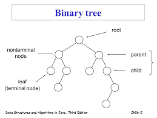

# 6부
### 22강 - 이진 탐색트리
* 이진 트리란?
  * 각 노드가 최대 두개의 자식을 갖는 트리
  * 자식 노드는 left, right로 나뉘며 자식이 없는 노드는 leaf라 한다.
  
  * 종류
    * 정 이진트리(full binary tree) 
      * 마지막 레벨을 제외한 모든 노드가 꽉찬 이진 트리
      * 마지막 레벨은 왼쪽에서 오른쪽으로 차있어야함.
    * 완전 이진트리(complete binary tree)
      * 모든 노드가 0 or 2개의 자식 노드를 가짐
    * 균형 이진트리(balanced binary tree)
      * 정이진트리이면서 완전 이진트리 
    
* 이진 탐색 트리
  * 트리가 항상 정렬 되도록 삽입과 삭제가 이루어지는 이진 트리
  * 삽입 : 빈자리를 찾을떄까지 루트값과 비교 후 작으면 왼쪽, 크면 오른쪽으로 이동
  * 검색 : 삽입과 동일한 당계
  * 탐색(순회) : [21장](./21_트리.md)에서 설명
  * 삭제 : 해당 노드를 제거 후 노드를 왼쪽에서 가장 큰 자식 또는 오른쪽에서 가장 작은 자식으로 바꾼다. (최소 하나의 자식을 가질떄 까지 교체)
  * 시간 복잡도 : O(LogN)-최선 ~ O(N)-최악
***

##### 출처 및 예시
* [이진트리1](https://ratsgo.github.io/data%20structure&algorithm/2017/10/21/tree/)
* [이진트리2](https://wkdtjsgur100.github.io/binary-search-tree/)
* [이진 검색트리](https://kka7.tistory.com/78)
* [문제1](https://algospot.com/judge/problem/read/NERD2)
* [문제2](https://algospot.com/judge/problem/read/INSERTION)
