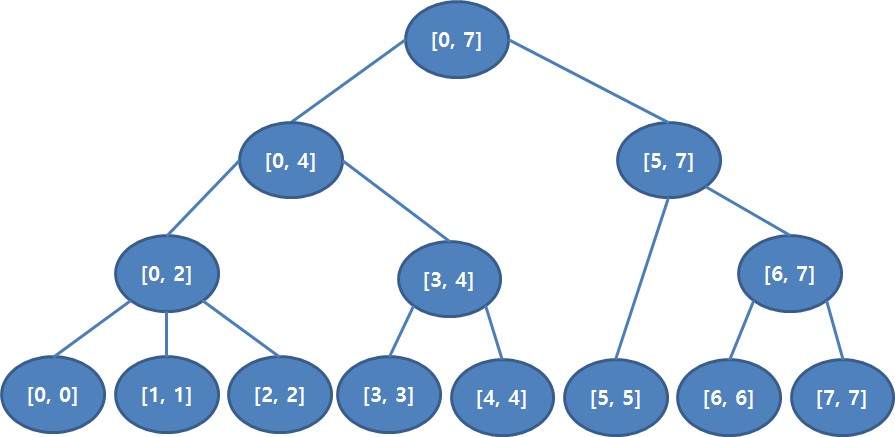
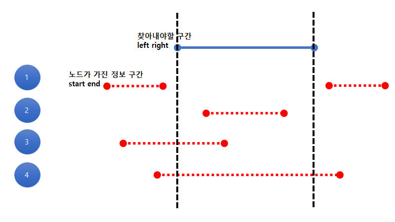

# 6부
### 24강 - 구간트리
* 구간트리(segment tree)
  * 배열의 정보를 구간으로 나눠 저장하여 구간에 대한 질의에 효율적인 처리를 위한 자료구조
  
  * 구간 트리 구성
    * 배열에 저장된 정보를 구간에 따라 나눠 세그트리를 구성한다.
    * 세그트리 구성에는 2^(데이터 수) 만큼의 배열이 필요하다. - 기본적으로 완전 이진트리의 형태를 사용한다.
  * 구간 트리 초기화
    ``` c++
    // 세그트리 초기화 
    typedef int type;
    vector<type> input;
    vector<type> seg;
    
    type mn2(type a, type b){
        return (a > b)? b : a;
    } // 최소값을 return
    
    type init(int node, int s, int e){
        if(s == e) return seg[node] = input[start]; // start 와 end 의 위치가 일치하면 input[start] 값을 넣어준다.
        return seg[node] = mn2(init(2*node, s, (s+e)/2) , init(2*node+1, (s+e)/2 + 1, e) ); // 다른 노드들의 정보를 
    }
    ```
  * 구간 트리 탐색
    
    1) 찾아내야 할 구간과 노드가 가진 정보구간이 겹치지 않는 경우. > **더이상 탐색 불가능, 상관 없는 값 return**
    2) 찾아내야 할 구간안에 노드가 가진 정보구간이 포함되는 경우. > **더이상 탐색 불가능, 현재 가진 정보 값 return**
    3) 찾아내야 할 구간과 노드가 가진 정보구간이 부분적으로 겹치는 경우. > **탐색을 끝까지 진행**
    4) 찾아내야 할 구간이 노드가 가진 정보구간 안에 포함되는 경우. > **탐색을 끝까지 진행**
    * 구간트리 탐색 코드
    ``` c++
    typedef int type;
    vector<type> input;
    vector<type> seg;
    const INF = 987654321;
    
    type mn2(type a, type b){
        return (a > b)? b : a;
    } // 최소값을 return
    
    // s-e : 노드정보구간
    // l-r : 찾을정보구간
    type query(int node, int s, int e, int l, int r){
        if(e < l || r < s) return INF; // 1
        if(l <= s && e <= r) return seg[node]; // 2
        return mn2(query(2*node, s, (s+e)/2 + 1, l, r), query(2*node + 1, (s+e)/2 + 1, e, l, r) ); // 3, 4
    }
    ``` 
  * 구간 트리 정보 변경
    * 업데이트 코드 
    ``` c++
    typedef int type;
    vector<type> input;
    vector<type> seg;
    const INF = 987654321;
    
    type mn2(type a, type b){
        return (a > b)? b : a;
    } // 최소값을 return
    
    // s-e : 노드정보구간
    // l-r : 찾을정보구간
    void update(int node, int s, int e, int index, int value){
        if(index < s || e < index) return ; // 2
        seg[node] = mn2(seg[node], value); // update
        if(s != e){ // 1
            update(2*node, s, (s+e)/2, index, value);
            update(2*node + 1, (s+e)/2 + 1, e, index, value);        
        }
    }
    ```
  * 구간 트리 활용 및 다른 자료구조
    1) LIS(Logest Increasing Sequence) : 수열에서 증가하는 부분수열을 뽑을때 최대의 길이 구하기
    2) 펜윅 트리(fenwick tree) : 구간합을 구하는데에 최적화된 자료구조 - 적은 시간과 공간을 사용
    3) 바이너리 인덱스 트리(binary indexed tree, BIT) : 2차원 배열에 대한 구간합 - 2차원 펜윅트리 사용
* 백준 알고리즘 문제 (+풀이)
  * [2042 구간 합 구하기](https://www.acmicpc.net/problem/2042)
  * [12015 가장 긴 증가하는 부분 수열 2](https://www.acmicpc.net/problem/12015)
    * 위 두문제는 출처 1에서 설명이 잘 되어있음.
  * 추가 문제
    [11505번: 구간 곱 구하기](https://www.acmicpc.net/problem/11505)
    [2357번: 최소값과 최대값](https://www.acmicpc.net/problem/2357)
    [12837번: 가계부 (Hard)](https://www.acmicpc.net/problem/12837)
    [1275번: 커피숍2](https://www.acmicpc.net/problem/1275)
    [2268번: 수들의 합](https://www.acmicpc.net/problem/2268)
    [3745번: 오름세](https://www.acmicpc.net/problem/3745)
    [1365번: 꼬인 전깃줄](https://www.acmicpc.net/problem/1365)
    [3006번: 터보소트](https://www.acmicpc.net/problem/3006)
    [1280번: 나무 심기 (★)](https://www.acmicpc.net/problem/1280)
    [3653번: 영화 수집 (★)](https://www.acmicpc.net/problem/3653)
    [9345번: 디지털 비디오 디스크 (★)](https://www.acmicpc.net/problem/9345)
    [2243번: 사탕상자 (★)](https://www.acmicpc.net/problem/2243)
    [2336번: 굉장한 학생 (★)](https://www.acmicpc.net/problem/2336)
***


##### 출처 및 예시
* [구간트리 설명(Ries 마법의 슈퍼마리오)](http://blog.naver.com/PostView.nhn?blogId=kks227&logNo=220791986409)
* [구간트리 코드 및 참조자료(윈도 블로그)](https://wondy1128.tistory.com/150)

